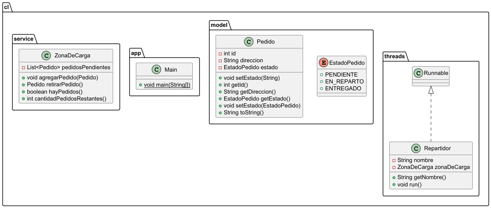

<h1 align="center">Welcome to SpeedFast</h1>

> Sistema de asignación y despacho de pedidos para SpeedFast.
> Aplica los principios de Programación Orientada a Objetos mediante herencia, clases e hilos.
> Sincronizado como sistema concurrente.
>

## Estructura Semana 5

    semana_5/
    ├── pom.xml
    ├── README.md
    └── src/
    └── main/
    └── java/
    └── cl/
    ├── app/
    │   └── Main.java
    ├── model/
    │   ├── EstadoPedido.java
    │   └── Pedido.java
    ├── service/
    │   └── ZonaDeCarga.java
    └── threads/
    └── Repartidor.java

## Modelos

| Clase          | Descripción                                                                           |
|----------------|---------------------------------------------------------------------------------------|
| `EstadoPedido` | Enum que categoriza el estado de los pedidos: `PENDIENTE`, `EN_REPARTO`, `ENTREGADO`. |
| `Pedido`       | Representa el pedido con una ID, dirección a despachar y estado del pedido.           |
| `ZonaDeCarga`  | Almacena los pedidos en `List<Pedido>` y sincroniza mediante `synchronized`.          |
| `Repartidor`   | Retira los pedidos e implementa `Runnable`. Simula la entrega.                        |
| `Main`         | Clase principal y punto de entrada. Inicializa la zona de carga e hilos.              |

## Diagrama de clases generado con PUML

## Instrucciones de ejecución

> - Clonar repositorio.
> - Abrir la carpeta `semana_5` en un IDE compatible con Java (recomendado: IntelliJ IDEA).
> - Ejecutar `Main.java`.

## Author

👤 **Matías Rivas Gallardo**

* Github: [@dageti](https://github.com/dageti)